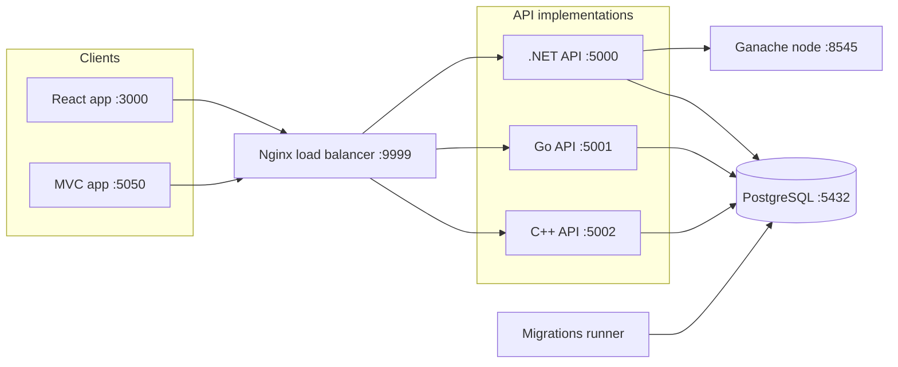

# Reminders

A simple and intuitive web application for managing your daily reminders.

🚀 **Live Demo**: [https://jumperck.github.io/Reminders](https://jumperck.github.io/Reminders)

## Features

- **User-friendly Interface**: Easily create, edit, and delete reminders with a clean and intuitive UI.
- **Persistent Storage**: Reminders are stored securely, ensuring you never lose your important tasks.
- **Customization**: Customize your reminders with different colors, tags, and priority levels.
- **Reminders Notification**: Receive timely reminders to stay on top of your tasks.

## Learning Project

As a learning project, the code here may not follow best practices at all times as it's a process of learning and improving. Feedback and suggestions are always welcome!

## Prerequisites

Before you begin, ensure you have the following installed on your system:

### Required

- **Docker** (v20.10 or higher) - [Install Docker](https://docs.docker.com/get-docker/)
- **Docker Compose** (v2.0 or higher) - Usually included with Docker Desktop
- **Git** - For cloning the repository

### Optional (for local development without Docker)

- **.NET SDK 8.0** - [Download .NET](https://dotnet.microsoft.com/download/dotnet/8.0)
- **Node.js 18+** and **npm** - [Download Node.js](https://nodejs.org/)
- **PostgreSQL 13+** - For local database development

### Port Requirements

Make sure the following ports are available on your system:

- **5000** - .NET API instance
- **5001** - Go API instance
- **5002** - C++ API instance
- **5050** - MVC application
- **3000** - React application
- **9999** - Nginx load balancer
- **5432** - PostgreSQL database
- **8545** - Ganache blockchain node

## Quick Start

Get the application running in 3 simple steps:

```bash
# 1. Clone the repository
git clone https://github.com/jumperck/Reminders.git
cd Reminders

# 2. Set up environment variables
cp .env.example .env
# Edit .env and replace YOUR_PASSWORD_HERE with a secure password

# 3. Start all services with Docker Compose
docker compose --profile all up -d

# Wait a few minutes for all services to build and start...
```

### Access the Applications

Once all containers are running:

- **React App**: [http://localhost:3000](http://localhost:3000)
- **MVC App**: [http://localhost:5050](http://localhost:5050)
- **API (via Load Balancer)**: [http://localhost:9999](http://localhost:9999)
- **.NET API**: [http://localhost:5000](http://localhost:5000)
- **Go API**: [http://localhost:5001](http://localhost:5001)
- **C++ API**: [http://localhost:5002](http://localhost:5002)

```bash
# Check container status
docker compose ps

# View logs
docker compose logs -f

# Stop all services
docker compose --profile all down
```

## Architecture

One REST contract, three interchangeable API implementations behind an Nginx load balancer, two frontends, and a dedicated migrations runner that prepares the database before any API starts. A local Ganache node backs the smart contract integration.



The migrations runner executes once per deployment and must complete before the APIs start. PostgreSQL is the default provider; SQL Server is supported as an alternative with its own migration set.

Architecture and workflow decisions are recorded as ADRs: see the [ADR index](docs/adr/README.md).

## Project Status

[](https://coveralls.io/github/jumperck/Reminders?branch=main)

### Build Status

#### Pull Request Checks

  [](https://github.com/jumperck/Reminders/actions/workflows/dotnet-pull-request.yml)

  [](https://github.com/jumperck/Reminders/actions/workflows/go-pull-request.yml)

  [](https://github.com/jumperck/Reminders/actions/workflows/react-pull-request.yml)

  [](https://github.com/jumperck/Reminders/actions/workflows/blockchain-pull-request.yml)

  [](https://github.com/jumperck/Reminders/actions/workflows/pull-request-check.yml)

#### Deployment & Testing

  [](https://github.com/jumperck/Reminders/actions/workflows/deploy-pages.yml)

  [](https://github.com/jumperck/Reminders/actions/workflows/cypress-e2e.yml)

  [](https://github.com/jumperck/Reminders/actions/workflows/dotnet-code-coverage.yml)

### Docker Hub

Reminders MVC:

  [](https://hub.docker.com/r/jumperck/reminders-mvc)

Reminders API:

  [](https://hub.docker.com/r/jumperck/reminders-dotnet-api)

## Testing

The project has unit tests (React/Jest), smart contract tests (Hardhat), .NET integration tests, and end-to-end tests (Cypress) covering the core reminder workflows. Run `./run-tests.sh` from the repository root for the automated suite, or see [CONTRIBUTING.md](CONTRIBUTING.md#testing) and the [Cypress Testing README](src/test/cypress/README.md) for how to run each suite individually.

Migrations are applied by a dedicated runner service before the APIs start - see [CONTRIBUTING.md](CONTRIBUTING.md#database-migrations) for how that works and how to troubleshoot it.

See [CONTRIBUTING.md](CONTRIBUTING.md) for general troubleshooting (ports in use, database connection issues, slow first build).

## Contributing

We welcome contributions! Please read [CONTRIBUTING.md](CONTRIBUTING.md) for details on:

- Setting up your development environment
- Project structure and architecture
- Database migration guidelines
- Testing requirements
- Pull request process

## Support

If you encounter any issues or have suggestions, we encourage you to open an issue on the [GitHub Issues](https://github.com/jumperck/Reminders/issues) page.

## Project Planning

Work is planned and tracked on the [Reminders project board](https://github.com/users/jumperck/projects/7). Progress updates follow GitHub's [sharing project updates](https://docs.github.com/en/issues/planning-and-tracking-with-projects/sharing-project-updates) guide.
